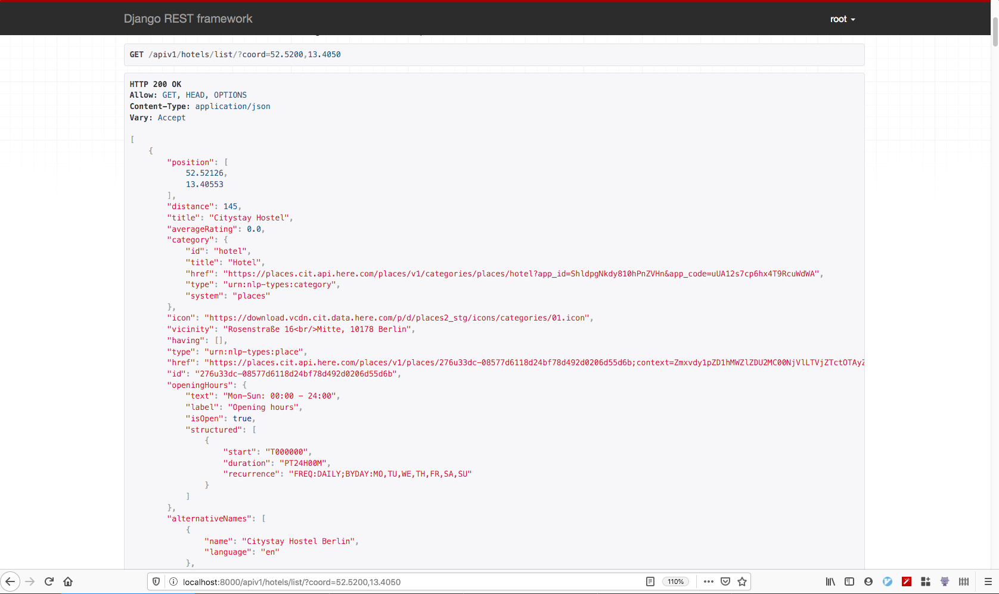

Coding-challange
--------------

Assignment topic here [assignment](./assignment.md)


## Setup and Installation

You would required Docker and Docker-compose [install them here](https://docs.docker.com/install/) in order to build this project on your local machine.

```sh
docker-compose build web
docker-compose run web python manage.py migrate # run the migrations
docker-compose run web python manage.py createsuperuser # to create the superuser
```


## Running the project

In order to run the project, run this command:

```
docker-compose run --service-ports web
```

This command ensures, that the server will run and pause it's execution if a debugger is set somewhere
in the code


## Running the tests:

The tests can be run like this `docker-compose run --service-ports web pytest -s`

```sh
Starting limehome-assignment_db_1 ... done
====================================================== test session starts =======================================================
platform linux -- Python 3.7.5, pytest-5.3.1, py-1.8.0, pluggy-0.13.1
Django settings: limehome.settings (from ini file)
rootdir: /code, inifile: pytest.ini
plugins: django-3.7.0
collected 2 items

hotels/tests/test_views.py ..

======================================================= 2 passed in 5.05s ========================================================
```

```python

def somefunc():
  a = 1
  import pdb; pdb.set_trace()
  return a
```


## API Testing

The API and docs can be found here: http://localhost:8000/apiv1/hotels/list/

An example call is here: http://localhost:8000/apiv1/hotels/list/?coord=52.5200,13.4050

This above API returns the list of hotels around the co-ordinate of Berlin.


```json
[
    {
        "position": [
            52.52126,
            13.40553
        ],
        "distance": 145,
        "title": "Citystay Hostel",
        "averageRating": 0.0,
        "category": {
            "id": "hotel",
            "title": "Hotel",
            "href": "https://places.cit.api.here.com/places/v1/categories/places/hotel?app_id=ShldpgNkdy810hPnZVHn&app_code=uUA12s7cp6hx4T9RcuWdWA",
            "type": "urn:nlp-types:category",
            "system": "places"
        },
        "icon": "https://download.vcdn.cit.data.here.com/p/d/places2_stg/icons/categories/01.icon",
        "vicinity": "Rosenstraße 16<br/>Mitte, 10178 Berlin",
        "having": [],
        "type": "urn:nlp-types:place",
        "href": "https://places.cit.api.here.com/places/v1/places/276u33dc-08577d6118d24bf78d492d0206d55d6b;context=Zmxvdy1pZD1iNDU1NThjOC02MmI5LTUyYTItOWYzZC1hNjcyMmU0NzdlYjlfMTU3NjIzNDgxNDcxNl8wXzUxNTgmcmFuaz0w?app_id=ShldpgNkdy810hPnZVHn&app_code=uUA12s7cp6hx4T9RcuWdWA",
        "id": "276u33dc-08577d6118d24bf78d492d0206d55d6b",
        "openingHours": {
            "text": "Mon-Sun: 00:00 - 24:00",
            "label": "Opening hours",
            "isOpen": true,
            "structured": [
                {
                    "start": "T000000",
                    "duration": "PT24H00M",
                    "recurrence": "FREQ:DAILY;BYDAY:MO,TU,WE,TH,FR,SA,SU"
                }
            ]
        },
        "alternativeNames": [
            {
                "name": "Citystay Hostel Berlin",
                "language": "en"
            },
            {
                "name": "Citystay Mitte",
                "language": "en"
            },
            {
                "name": "Citystay Mitte Hotel Berlin",
                "language": "en"
            },
            {
                "name": "Citystay Hostel Berlin",
                "language": "de"
            }
        ]
    }
]
```


